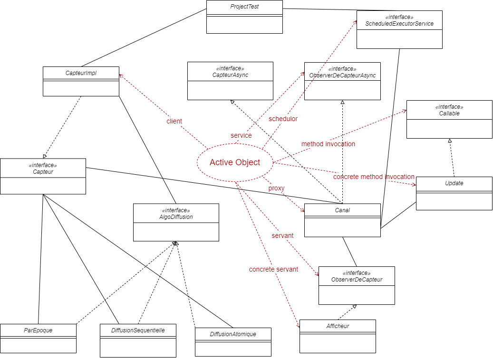
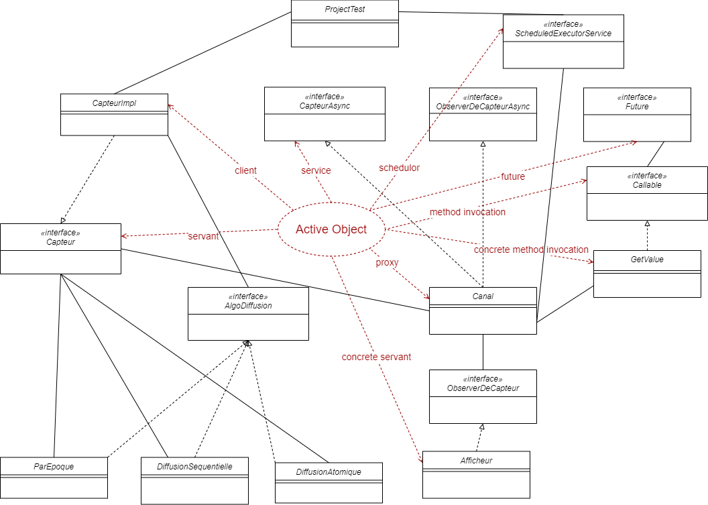
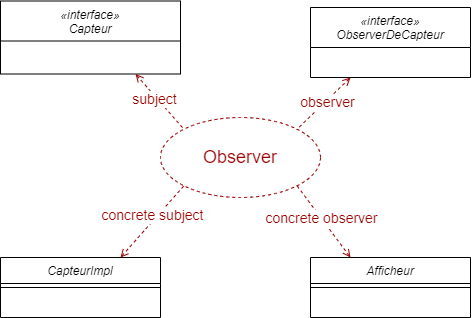
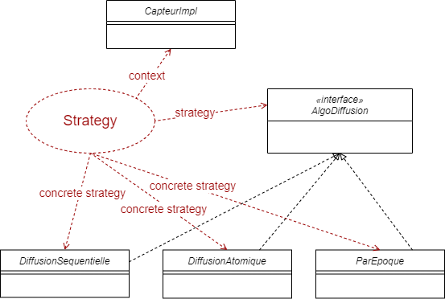
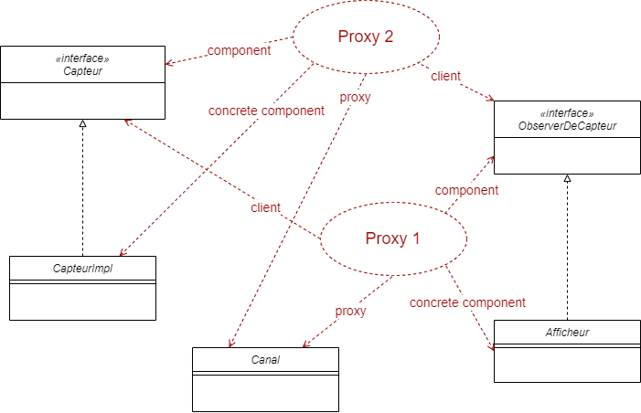
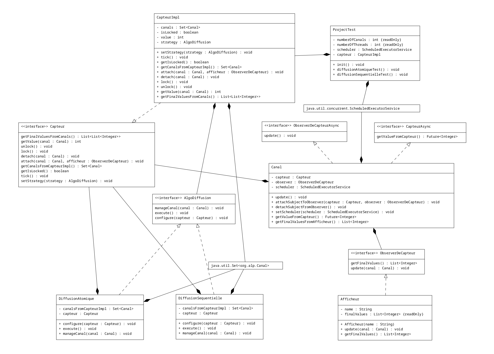
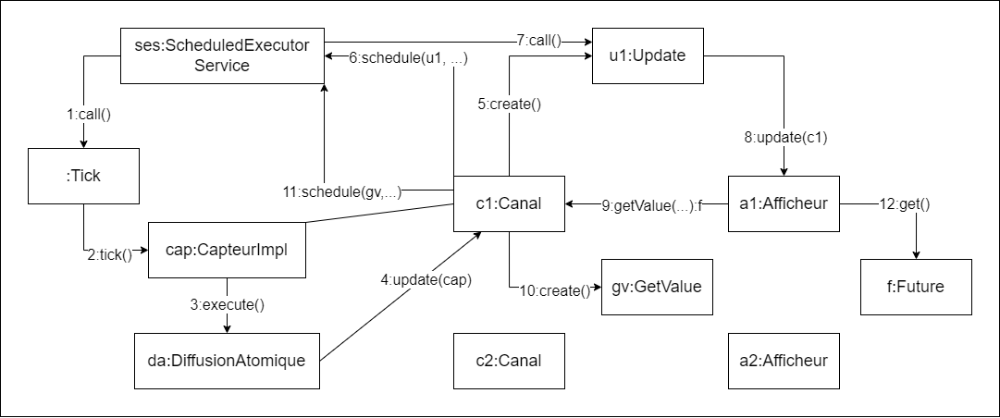
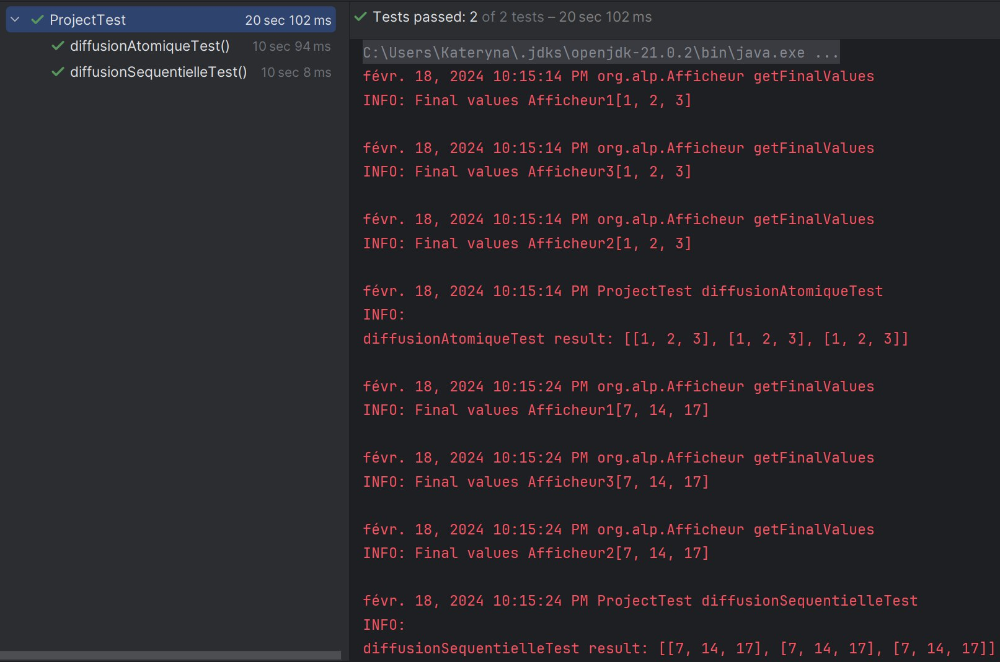

[### SHCHERBAKOVA Kateryna, TKACHENKO Oleksii

### M2 IL, ALP

# Project: Active Object, Observer, Strategy, Proxy

--- 

# Overview

In this project, we implemented a system for data diffusion from a sensor (`CapteurImpl`) to multiple display
units (`Afficheur`) through intermediary channels (`Canal`). Two diffusion strategies, atomic
diffusion (`DiffusionAtomique`) and sequential diffusion (`DiffusionSequentielle`), were implemented to explore
different modes of data transfer. We also employed several design patterns such as
**Active Object**, **Observer**, **Strategy** and **Proxy** to ensure modularity, flexibility, and efficiency in our
system.

---

# Design patterns concept

## 1. Active Object

In the project, the Active Object pattern is utilized through the asynchronous behavior of the `Canal` class. The Active
Object pattern is a concurrency design pattern that decouples method execution from method invocation to enhance
concurrency and responsiveness. In our project, the Active Object pattern is applied through the asynchronous scheduling
of updates and the use of futures for value retrieval, enabling concurrent and responsive behavior in the system.

### Active Object for the asynchronous scheduling of updates

The `Canal` class schedules updates asynchronously using a `ScheduledExecutorService`. When the sensor data changes,
instead of immediately notifying the attached `Afficheur`, the `Canal` schedules the update operation to be executed
after a certain delay. This decouples the update operation from the main thread, allowing the main thread to continue
its execution without waiting for the update to complete. As a result, the system remains responsive and can handle
other tasks concurrently.

### Active Object for the use of futures for value retrieval

The `Canal` class provides a method `getValueFromCapteur()` that returns a `Future<Integer>`. This future represents the
value that the `Canal` will eventually receive from the `Capteur`. By returning a future, the `Canal` allows the caller
to retrieve the sensor value asynchronously without blocking the main thread. The caller can continue its execution and
retrieve the sensor value from the future when it becomes available, enhancing concurrency and responsiveness.

## 2. Observer

The Observer pattern is employed in the project to establish a one-to-many dependency between objects, ensuring that
when one object changes state, all its dependents are notified and updated automatically. In our project, when the
sensor data changes, the `Canal` class notifies all attached observers (`Afficheur`) asynchronously
through the `update()` method. The Observer pattern separates `CapteurImpl` (subject) from `Afficheur` (observer),
allowing them to change independently of each other.

## 3. Strategy

The Strategy pattern allows the client to vary the algorithm independently of the objects that use it. In our
project, we have two concrete strategies: atomic diffusion (`DiffusionAtomique`) and sequential
diffusion (`DiffusionSequentielle`), which represent different modes of data transfer from the sensor (`CapteurImpl`) to
the display units (`Afficheur`). This separation of strategies enables us to modify, extend, or replace the
diffusion algorithm without affecting the `CapteurImpl` or `Afficheur` classes.

### Atomic diffusion strategy

The `DiffusionAtomique` class implements the atomic diffusion strategy, where all observers receive the same value
simultaneously when the sensor data changes. This strategy ensures consistency among observers and prevents any observer
from receiving outdated or inconsistent data.

### Sequential diffusion strategy

The `DiffusionSequentielle` class implements the sequential diffusion strategy, where observers receive
the value sequentially in the order they are attached. This strategy allows for variations in the sequence of receiving
data among observers, potentially influencing their behavior.

## 4. Proxy

The Proxy pattern is utilized in the project to control access to the `CapteurImpl` and `Afficheur` objects, acting
as intermediaries.

---

# Project structure

The main classes of the project are as follows:

- `CapteurImpl`: Represents the sensor responsible for generating data.
- `Afficheur`: Represents the display unit that visualizes data received from the sensor.
- `Canal`: Acts as an intermediary channel between the sensor and display units for data transmission.
- `DiffusionAtomique`: Implements the atomic diffusion strategy for transmitting data from the sensor to display units.
- `DiffusionSequentielle`: Implements the sequential diffusion strategy for transmitting data from the sensor to display
  units.

---

# Execution flow

- In the test class, a sensor and several displays linked by channels are set up.
- The sensor regularly increments its data.
- Sensor notifies the channels.
- Channels asynchronously broadcast the update to the display units based on the chosen strategy.
- Each display unit asynchronously requests the updated value through the intermediary channels.
- The channels query the sensor for the current value, which is returned asynchronously via futures.
- The updated value is relayed back to the display unit.

---

# Test results

The test results indicate that both diffusion strategies, atomic and sequential, successfully deliver the sensor data to
the display units. However, there are differences in the timing and order of data delivery.

- `Atomic Diffusion`: In this strategy, all display units receive the updated data simultaneously. All displays receive
  the updated data at the same time, like they're all synced up. As shown in the test
  results, all display units receive the same final values [1, 2, 3]. This strategy ensures consistency among display
  units and is suitable when all units need to process the same data simultaneously, such as in real-time monitoring
  systems.

- `Sequential Diffusion`: The sequential diffusion strategy delivers the data to display units sequentially, in the
  order they are attached. So, each display gets the data only after the previous display has already received and
  processed it. This can lead to each subsequent display getting the data with some delay compared to the previous one.
  As a result, the final values received by each display unit are [7, 14, 17]. This strategy allows for variations in
  the timing and order of data delivery among display units, which may be beneficial in scenarios where the order of
  processing matters.

---